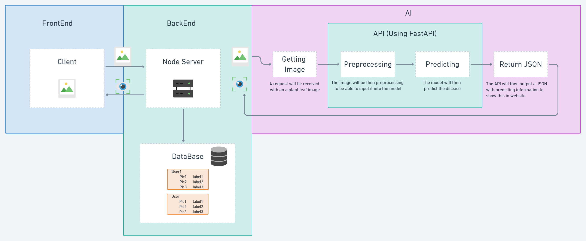

# Plant Disease Detection (GrowersBrainsML)

## Problem Definition

The user to be able to take a picture of their plant **leaf** and have detecting any possible disease from that.

 

 
# Dataset

- [PlantVillage Dataset](https://www.kaggle.com/emmarex/plantdisease)

# Tools we are using

- [FastAI](https://www.fast.ai/)  - For Data Reading & Preprocessing & Training DL Model
- [FastAPI](https://fastapi.tiangolo.com/) - For wrapping the DL Model into an API an send it to Backend Team
